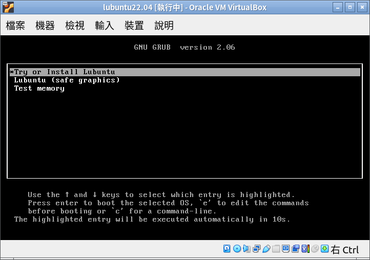

# virtualbox 虛擬機環境設定

## 安裝 virtualbox 虛擬主機系統
1.前往官網，下載後安裝 (https://www.virtualbox.org/)

## 使用 virtualbox 安裝 lubuntu 22.04

安裝 lubuntu 只是要讓大家了解一下虛擬機的使用方式，後面 librems 教學不會使用這個安裝好的虛擬機

1. 下載 lubuntu 22.04 iso 檔 （https://lubuntu.me/downloads/）
2. 執行 vbox ，準備建立一個虛擬機

接下來一直按下一步，最後按完成即可

3. 設定主控端跟虛擬機剪貼簿可以共用

4. 虛擬機的網路有幾種模式，如果要當作 server ，要改成橋接

5. 按下啟動，就會開始啟動虛擬機，因為虛擬機器一開始有掛載 lubuntu 安裝光碟，所以機器啟動後就會進入安裝畫面

