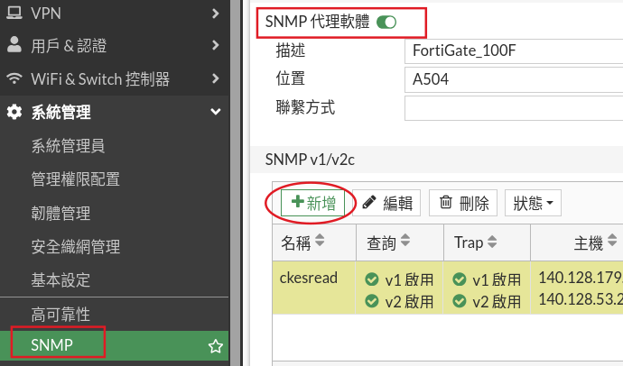
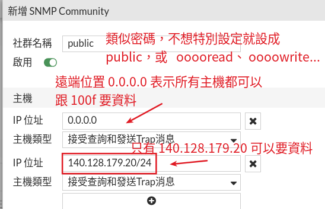
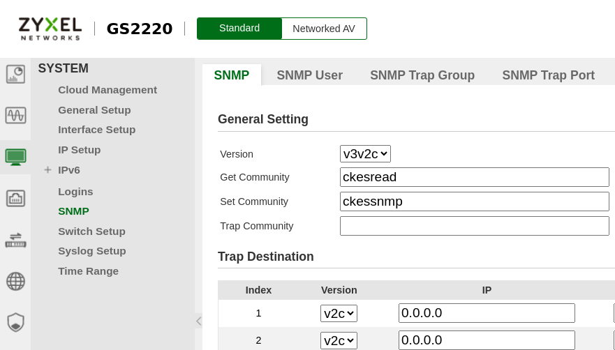

# 防火牆、交換器（網路裝置）啟用 snmp 服務

網路裝置本身區有支援 snmp 服務，這樣遠端的 snmp 管理系統才能連到裝置取得資料。因為每個網路裝置的界面都不一樣，以下僅示範幾種裝置如何啟用 snmpd 服務。

snmp 服務有兩種限制遠端管理系統存取 snmp 資料的機制，一種是設定「社群名稱」，其實就類似密碼。遠端 snmp管理系統必須知道交換器設定的社群名稱，才能正確存取到資料。
另外一個機制是限制遠端機器的 ip 位址，這兩種機制必須同時符合交換器的設定，遠端 snmp 管理系統才能正確存取到資料。

社群名稱如果不想特別設定可以使用 public，有些機構喜歡用 ooooread、oooowrite ..來設定社群名稱。

限制的遠端 ip，一般會使用「ip/子網路遮罩長度」 的格式設定，例如
140.128.179.20/24 就表示只允許 140.128.179.20 這台機器存取。
設定成 0.0.0.0 通常表示所有遠端社都可以跟我要資料。

## FortiGate 100f

ip 存取限制可以有多組設定，當然以下是錯誤示範，已經設定 0.0.0.0 表示同意所有機器存取，這樣後面的設定就都是多餘的。

## Zyxel 2220

