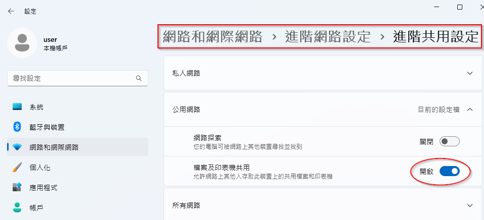
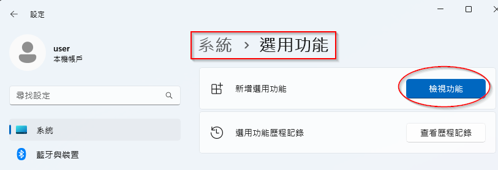
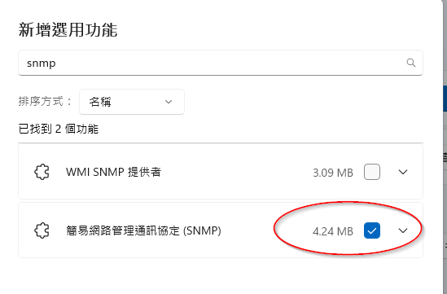
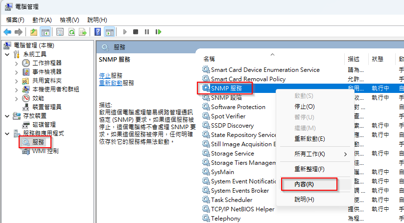
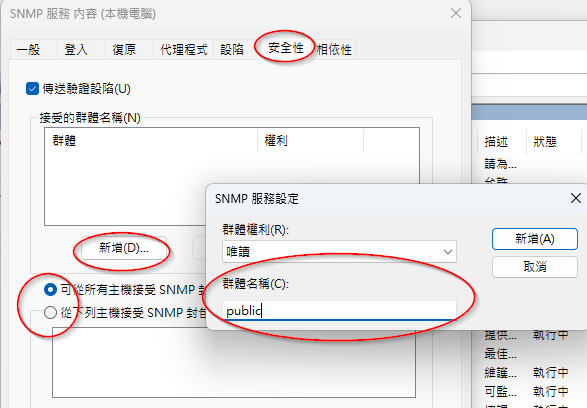

# Win11 啟用 snmp 服務

win11 也是一台網路裝置，所以也可以被 NMS 來管理，不過我們要自己啟用 snmp 功能及服務。

## 開啟 icmp 回應

一台網路裝置當然要可以 ping 的到才容易判定是否在線， win11 預設不回應 ping。只要將
檔案共用的功能打開， win11 就會順便啟用 icmp 回應了以及打開本機防火牆相關設定。

## 安裝 snmp 服務

win11 有內建 snmp 服務相關程式，不過是放在選用功能內，。所以還是需要手動安裝

1. 首先到「設定/系統/選用功能」（不同版號的 windows 可能會放在不同路徑 ex:應用程式/選用功能）

2. 勾選【簡易網路管理協定(snmp)】 
   

3. 安裝完成後，在開始功能表按滑鼠右鍵，執行電腦管理。在服務的區域找到 snmp 服務，按滑鼠右鍵選「內容」
   

4. 在「安全性」的分頁底下設定群體名稱、以及要限制可以存取 NMS ip範圍。如果沒看到這個「安全性」分頁，可能是元件未安裝完成，或是需要重開機。

