# 使用 Proxmox 安裝 Librenms 範本

Proxmox VE 是一款基於Debian 為核心的開源伺服器虛擬化平台，非常推薦大家使用。

虛擬機 (KVM) 技術因為完整模擬整個主機系統，所以非常耗資源，建議改用 LXC 技術的虛擬容器(CT)，耗用的資源非常少又快速。

## 下載 librenms ct 範本
因為  Librenms 官方沒有提供 CT 的範本，以下提供自製的範本，供大家快速安裝。

CT 範本下載： [lbrenms-20240620.tar.gz](https://drive.google.com/file/d/1OyPnE5DgbUiLwi8FEwohUtNH0kMxJIgB/view?usp=drive_link)

## 建立 CT 虛擬容器

1. 將範本檔上傳到 proxmox 主機
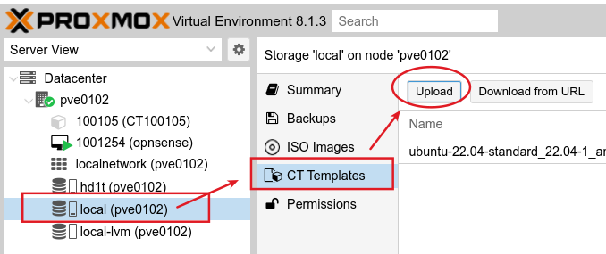

2. 右上角建立一個新的 CT
   
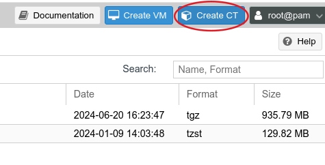

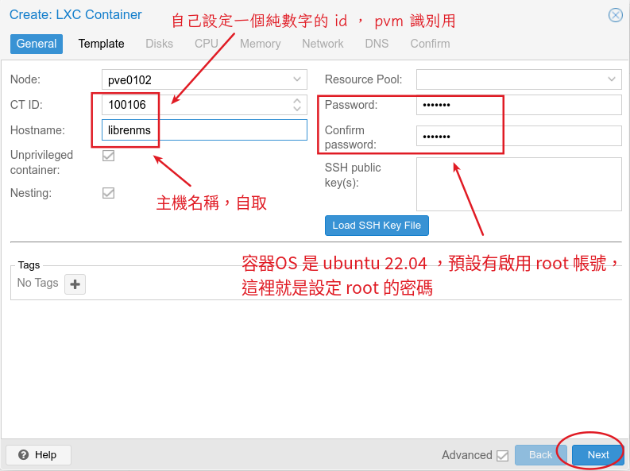

選取剛剛上傳的範本
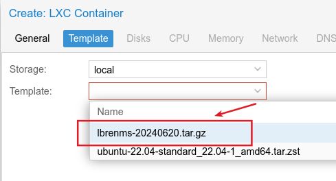

設定要給這個容器多少硬碟空間
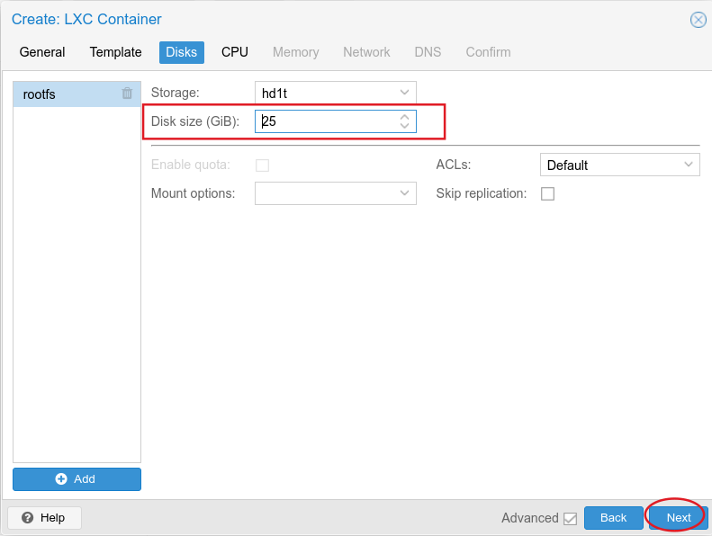

要給容器的 CPU 核心數，librenms 不需要給太多 1 或2 都可以
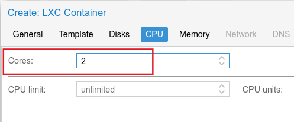

要給容器的 cpu 核心數跟記憶體都是隨時可以修改，而且容器都不需要中斷執行，所以可以以後觀察使用的負載情況去調整即可。
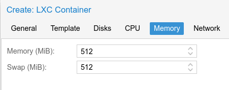

每個容器都有一個獨立的 ip，這裡以 10.1.1.6 做範例。 如果要支援 ipv6 也可以設定好。
防火牆建議可以先取消勾選，省的遇到其他被封鎖的問題
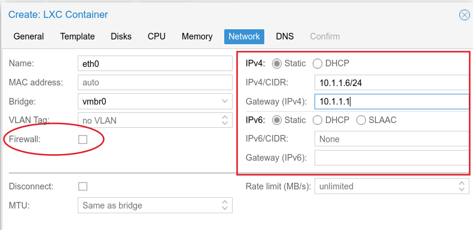

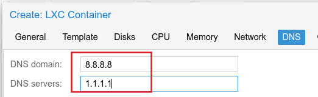

最後一步，按下完成後，就會建立 CT 並且開始執行
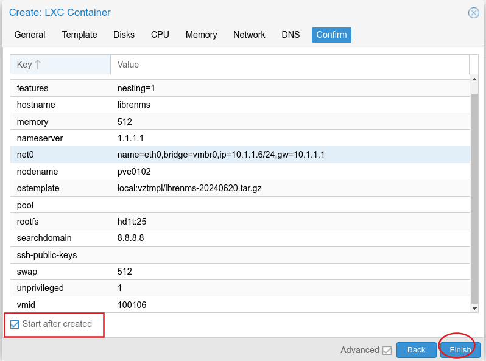

最後使用瀏覽器開啟 http://10.1.1.6 使用範本預設的帳號、密碼 librenms 。就可以開使用強大的 Librenms了。
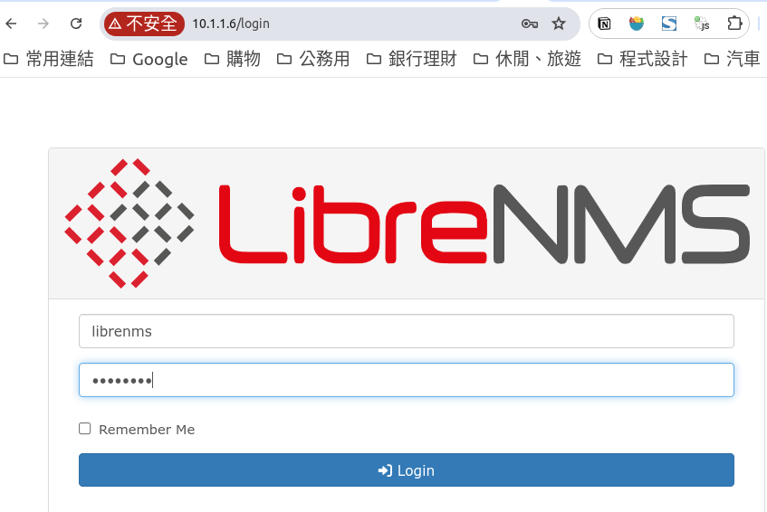

