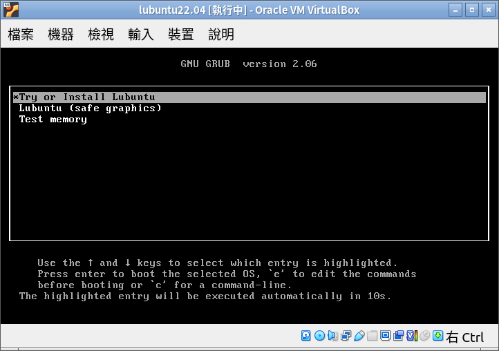
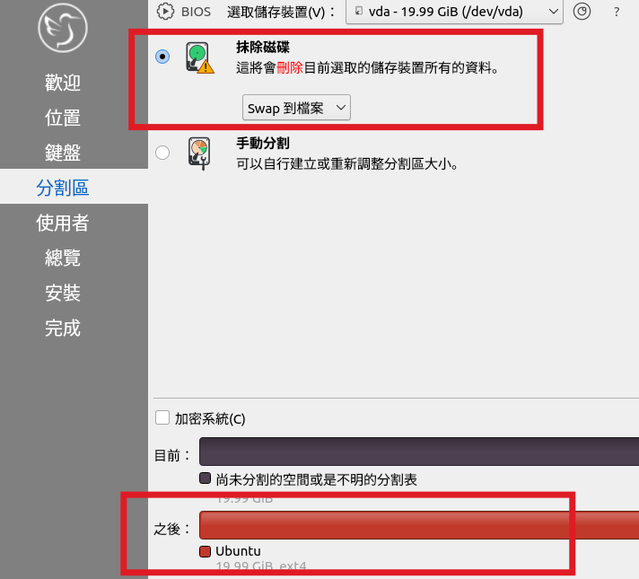
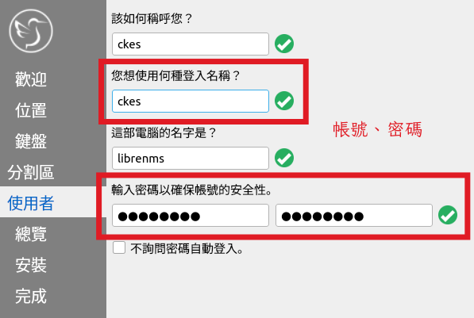
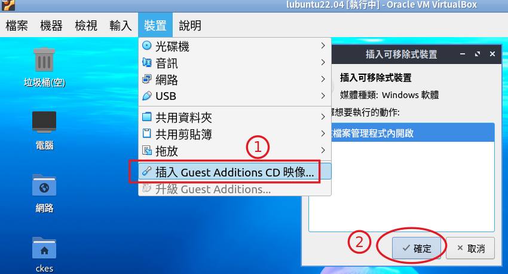
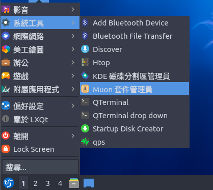
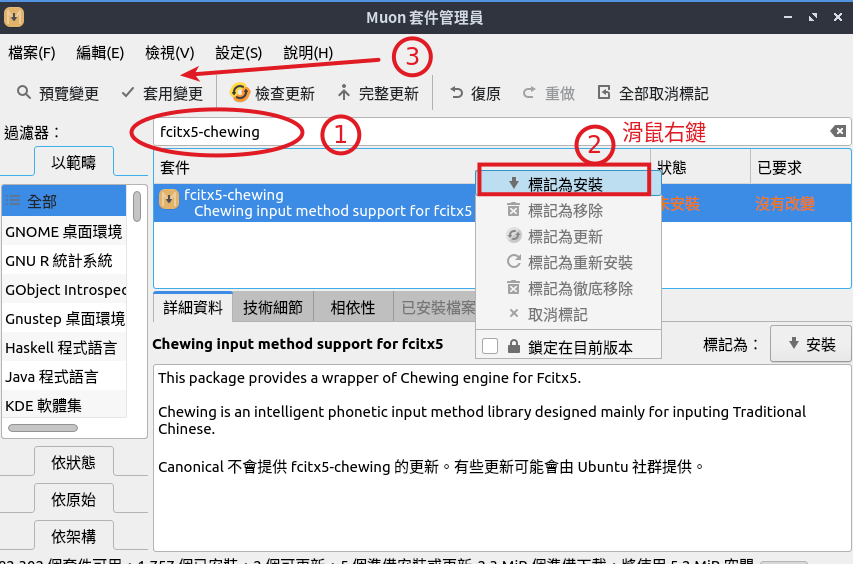

# Lubuntu 22.04 安裝 

## 製作 lubuntu 安裝開機 usb
1. 下載 lubuntu 22.04 iso 檔，使用軟體製作 usb 開機檔

lubuntu 22.04 (https://lubuntu.me/downloads/)

rusuf (https://rufus.ie/zh_TW/)

## 安裝 lubuntu
1.使用 usb 開機，執行第一個選項，就會先以 live cd 的模式進入 lubuntu 作業系統的界面，點選桌面的 install Lubuntu 圖示，就會開始安裝 lubuntu 

2.依照安裝指示一直按下一步即可，以下僅顯示需要做選擇或輸入的部份提示

安裝完成後，移除 usb 後重新開機

## 安裝 Guest Additions
為了讓 host主控端要跟虛擬機（guest端）做進階的功能聯繫，所以虛擬機需要安裝 virtualbox 的 guest addition 程式
   
   

4. 安裝中文輸入法，在終端機（命令列）視窗內，

執行以下指令安裝中文輸入法

`sudo apt install fcitx5-chewing`

備註1： sudo 允許一般用戶以 root 或其他特定帳號執行程式

備註2： 不使用命令列安裝軟體，從功能表執行「」

## 常用軟體推薦，請試著自己安裝看看

