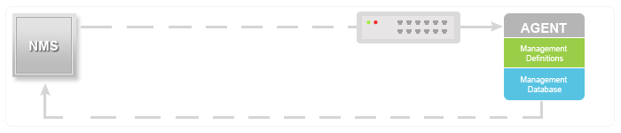
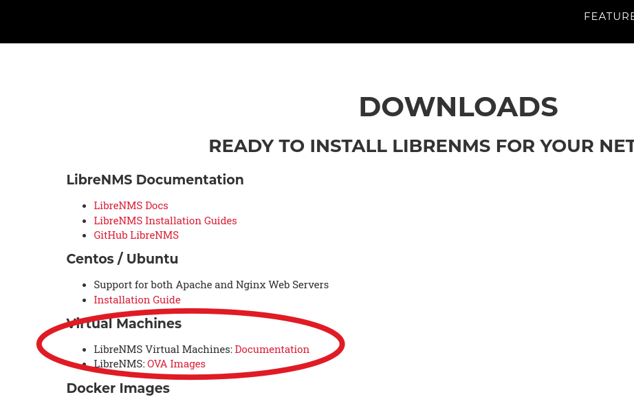
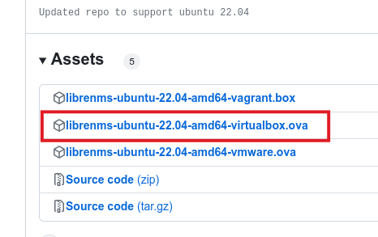
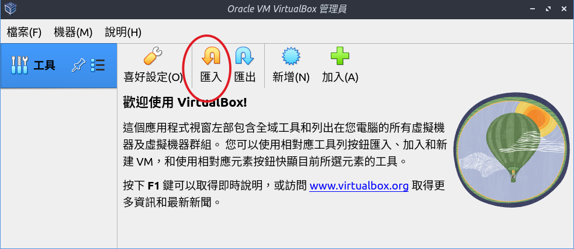
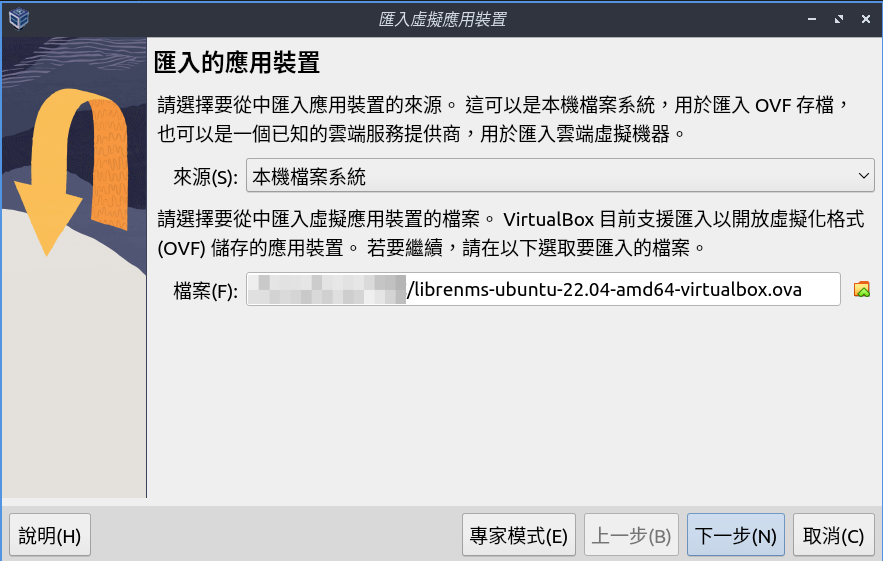
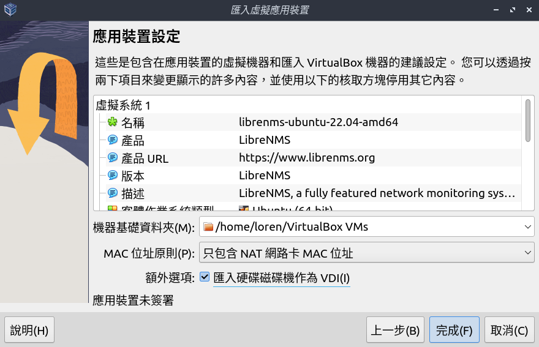
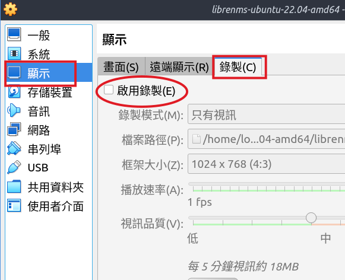
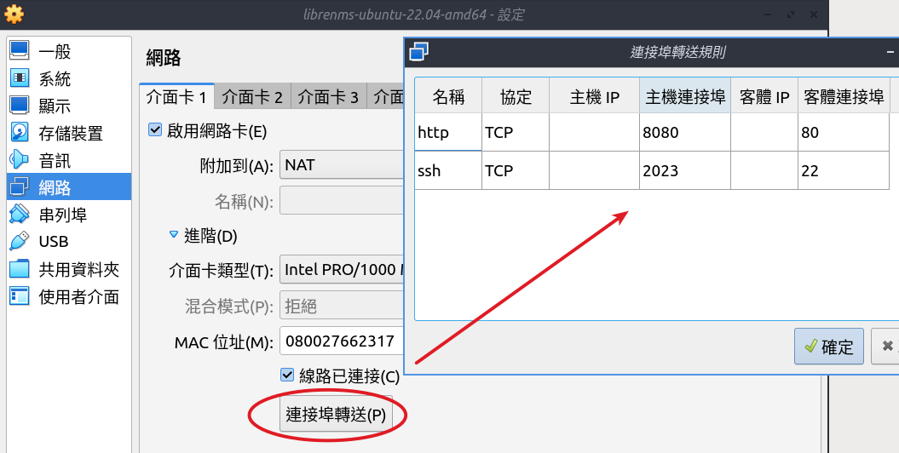
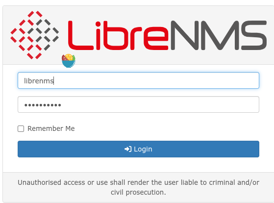
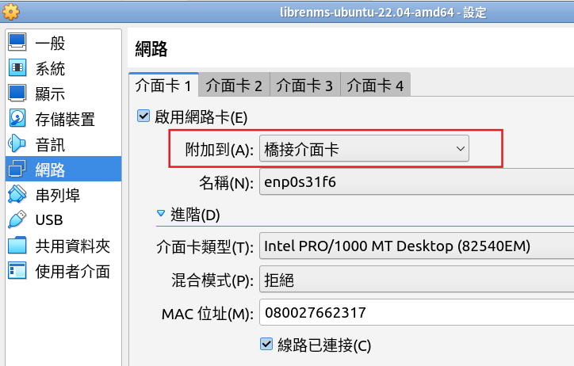

# LibreNMS - SNMP 網路管理系統

## 什麼是 LibreNMS?
LibreNMS 是一套支援 SNMP 協定的「網路管理系統」（NMS）。 官方網站： https://www.librenms.org/

## 什麼是 SNMP : 簡易網路管理通訊協定 (SNMP) 
這篇寫得很完整 [SNMP 教程](https://www.manageengine.com/tw/network-monitoring/what-is-snmp.html)

***GET/GET NEXT/GET BULK/SET*** NMS 使用 port 161 傳送請求給網路裝置，裝置使用 port 161 回傳資料給 NMS


***TRAP*** 網路裝置也可以主動傳送資料給 NMS


## 安裝 librenms
1. 前往 LibreNMS 官方網站，[安裝說明頁](https://www.librenms.org/#downloads)有各種系統的安裝方式

2. 我們將直接採用官方製作好的虛擬機匯入檔，簡化安裝的步驟

下載 virtualbox 的虛擬機匯入檔


3. 匯入下載的印象檔，用來建立新的虛擬機




按下完成後，稍待虛擬機建立好，先進入虛擬機的設定，將錄製選項取消勾選。這個選項會將整個虛擬機的畫面錄製成影片。


匯入檔網路部份雖然是使用 NAT，但是他已經有設定連結埠轉送，所以也**沒必要**改成「橋接模式」。

這個設定就是說，你在 host 端的瀏覽器，連接 http://localhost:8080 就等於是連到 guest 端機器的 80port。

接著我們啟動這個虛擬機後一個完整的 ubuntu + LibreNMS 系統就完成了。
在我們電腦了瀏覽器，開啟 http://localhost:8080 就可以看到 LibreNMS 的網頁 GUI 界面了。
虛擬機預設的 LibreNMS 的帳密是
```
username: librenms
password: D32fwefwef
```



## 設定 ipv6(選用)

虛擬機預設是使用 NAT + dhcp ，如果要增加 ipv6 的支援，建議就不要使用 NAT， Guest 主機改成用「橋接網路」。讓虛擬機有一個獨立的 ip 這樣設定虛擬機的 ipv4 跟 ipv6，就可以更接近一般獨立的 server。

1. 設定 guest 使用橋接模式


2. 登入 guest 主機，修改主機的網路設定
虛擬機 ubuntu 作業系統( ssh )的使用者帳密是
```
username: vagrant
password: vagrant
```
3. 先安裝 nano 文字編輯器
```shell
sudo apt update
sudo apt install nano
```
4. 編輯網路設定檔
```shell
sudo nano /etc/netplan/01-netcfg.yaml 
```
修改內容為以下設定 (ipv4 ipv6 gateway dns) 請自行依據實際內容修改
```txt
network:
  version: 2
  renderer: networkd
  ethernets:
    eth:
      match:
        name: en*
      accept-ra: no
      addresses:
        - 140.128.179.5/24
        - 2001:288:5220::05/64
      gateway4: 140.128.179.254
      gateway6: 2001:288:5220::ff
      nameservers:
        addresses: [1.1.1.3, 2606:4700:4700::1113]
```
nano 使用 ctrl+o、ctrl+x 存檔，因為右邊 ctrl被 host 終端攔截了，所以記得要使用左 Ctrl

執行以下指令套用前面的網路設定
```
sudo chmod 600 /etc/netplan/01-netcfg.yaml
sudo netplan apply
```

5.「全域設定/系統/伺服器」修改主機名稱

如果有修改主機的 ip，記得需要到「全域設定/系統/伺服器」修改主機名稱（網域名稱或ip位址），不然有些功能的連結會出現  (404 not found) 的錯誤。


參考資料
1. (https://www.snel.com/support/how-to-configure-ipv6-with-netplan-on-ubuntu-18-04/)
