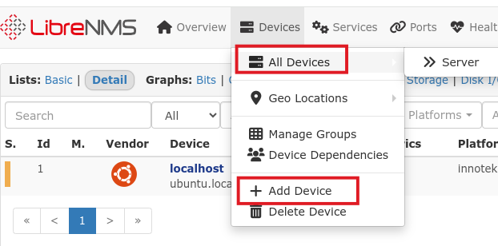
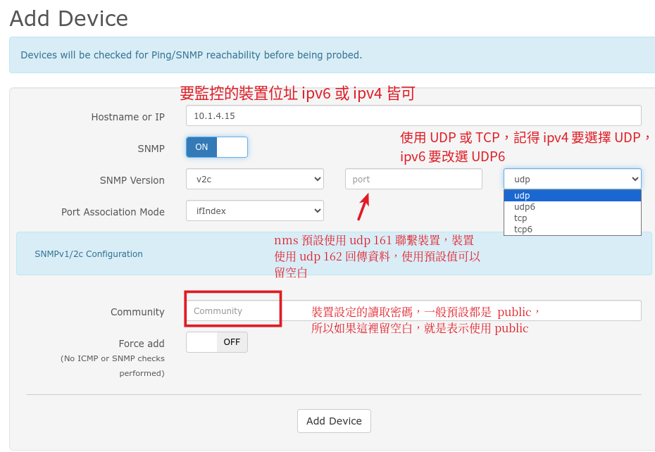

# 新增 snmp 裝置

虛擬基本身就是一個網路裝置，所以這個虛擬機，已經自己先監控自己本身這臺機器。一般網管型伺服器、網路型印表機都有提供 snmp 協定的服務，以便 nms 監管。甚至是一般的 windows 電腦都有內建 snmp 服務可以手動安裝開啟。

先執行 [Devices/All Devices] 點選 localhost 這臺機器，看看可以看到哪些資訊。 

## Add Device
接著我們加入一台網管型交換器，執行功能選單[Devices/+ Add Device]

教網配發的網管交換器 Community 是設定成 xxxxread ，xxxx是學校網域縮寫

