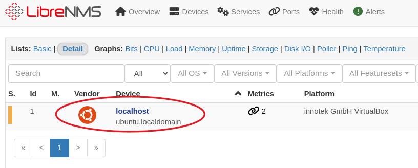
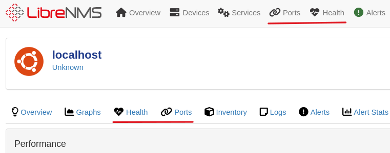
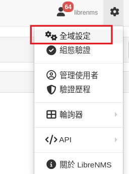
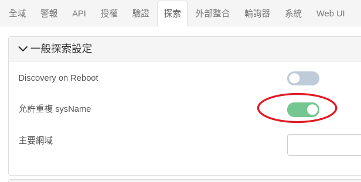
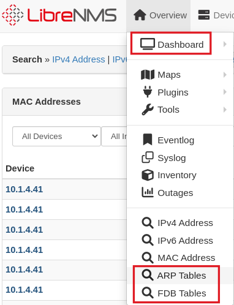
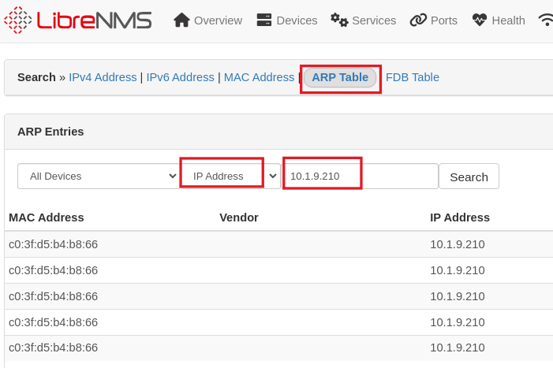

# 新增 snmp 裝置

虛擬基本身就是一個網路裝置，所以這個虛擬機，已經自己先監控自己本身這臺機器。一般網管型伺服器、網路型印表機都有提供 snmp 協定的服務，以便 nms 監管。甚至是一般的 windows 電腦都有內建 snmp 服務可以手動安裝開啟。


先執行 [Devices/All Devices] 點選 localhost 這臺機器，看看可以看到哪些資訊。 


每個子頁面都點進去看看吧



## Add Device
接著我們加入一台網管型交換器，執行功能選單[Devices/+ Add Device]


教網配發的網管交換器 Community 是設定成 xxxxread ，xxxx是學校網域縮寫
一般只要填入 Hostname or IP，以及選擇是 upd 還是 upd6 按下 「Add Device」 就可以看到機器被加入監控。

## 自動加入裝置
1. 網路找到的教學都是編輯設定檔，不過現在 librenms 已經可以從 web gui 界面設定，不過從 gui 界面設定的資料是存在資料庫中，不是在設定檔中，所以建議不要混用，直接在 gui 界面設定即可。

 

因為交換器的 snmp 可能 sysName 是空白沒有設定，所以要允許 sysName 可以重複，不然就沒辦加入相同名稱的裝置。

2. 要掃描的 ip 範圍


3. community 如果是預設，這邊就不用新增，如果有自訂的 community ，要再這裡新增，這樣才能成功加入新裝置


4.自動探索會要求設備要有主機名稱（dns 要設定），預設不使用 ip 增加裝置，所以我們還是必須要去編輯設定檔。登入 librenms 主機終端機
username: librenms
password: CDne3fwdfds

先安裝 nano 文字編輯器（ vi 指令我背不起來 >< ）
```shell
sudo apt update
sudo apt install nano
```

編輯設定檔

```
nano /opt/librenms/config.php
```
在設定檔加上以下這一行
```
$config['discovery_by_ip'] = true;
```
以上設定好， librenms 就會自動探索（6小時一次）

***ps: virtualbox 使用右邊 ctrl 作為脫離虛擬機視窗的按鍵，所以 nano 要存檔及離開，請使用[左側Ctrl+O]、[左側Ctrl+x]***


## 手動 snmp 掃描
自動探索是利用交換器的 XDP 之間的連線資訊來更新裝置。我們可以使用手動掃描整個網域的 snmp 來強制更新裝置。只要在 /opt/librenms/ 目錄下，執行 #snmp-scan.py -v 即可看到掃描的過程

```
cd /opt/librenms/
./snmp-scan.py -v 
```


# 常用應用介紹


## arp table
L3 用來紀錄 ipv4 跟 mac address 的對照表。所以交換器、電腦、router只要有封包通過，就會快取 ipv4跟 mac address 的對照資料，因為會更新快取，所以留存時間不長，如果電腦未連線，可能就查詢不到。

## fdb (forwarding database) table
L2 交換器會紀錄哪個 port 通過的封包 mac address，以及方向。所以經過分析，如果進入某個交換器的某個 port，一直都是固定的 mac address，我們就可以知道該裝置就是接在那個孔上面。

## 尋找網路裝置在哪裡？
1. 假設要找 10.1.9.210 在哪邊，先使用 arp 查詢找到他的 mac address


2. 接著使用 FDB 查詢，填入 mac address 查詢，會查詢到很多交換器的 port 都有通過這個 mac address的封包，可是有一個 port 每次進入的封包，都是這個 mac address，所以 librenms 就猜測，這個裝置應該就是在這個 port 上。


不過這個裝置需要接在網管型交換器上面，才查詢的到，所以如果沒有查詢到星號，表示這個裝置中間還有接到一般非網管交換器。


# 結論： ip 鎖 mac 才是王道
