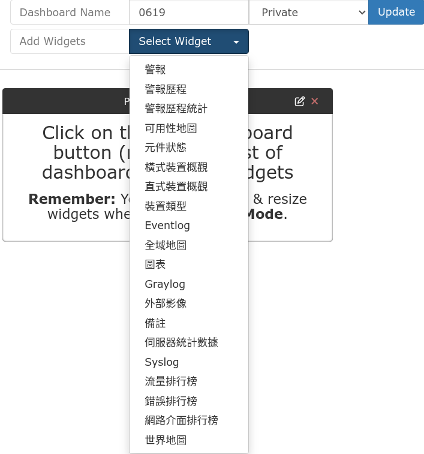

# 資訊看板


## 新增看板(Dashboard)

可以自訂一些隨時監看的資訊或圖表，就稱為資訊看板。

::: tip
拿臺 pi + 小螢幕顯示網管資訊看板，看起來就很 pro
:::


資訊看板可以很多個，還可以設定是否可以公開瀏覽，可作為電視牆之類的看板資訊播放用


按下編輯，可以在看板中建立各式的小部件 (Widget)，用來顯示圖表或是清單


* 



以下示範幾個小部件推薦可以試試看： 

## 可用性地圖
顯示所有裝置目前上線或離線狀態


## 圖表
可以顯示各種在裝置中可以看到的圖表，例如顯示防火牆的對外 port 的 bits圖表，就可以知道長期頻寬使用情形


## 流量排行

這裡的流量是以網路裝置的 port，為基礎（因為這是網路裝置管理系統，管的是 ***裝置*** ），如果想知道哪個 ip 的流量應該是要去防火牆或是 netflow 的日誌系統看。


## 外部影像

這個小部件用途很廣，可以顯示外部連結的圖片，並且會定期更新。
例如網路上找個乖乖的圖片，把它圖片連結貼上，就可以放包乖乖保佑設備，又不會被老鼠咬。
1. 
 

2. 或是後面會介紹的 weathermap 裝置流量圖也會產生一個影像的連結，這個連結也可以讓它呈現在看板中。
   
   
## 隱藏選單
在看板網址後面加上 ***?bare=yes*** 就可以顯示沒有選單的看板，可用來作為電視牆展示之類的應用 ex:
```
http://localhost:8080/dashboard/1?bare=yes
```
