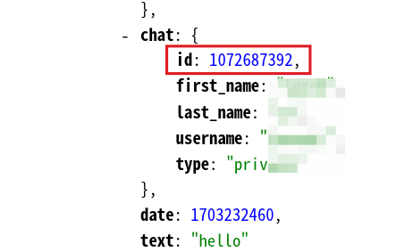
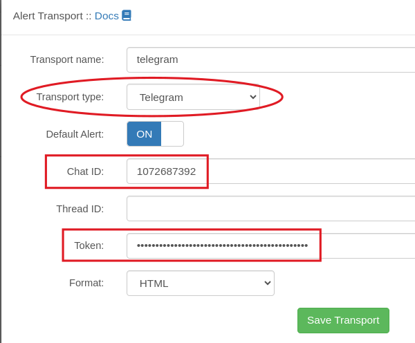
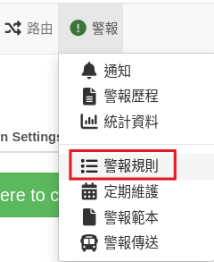
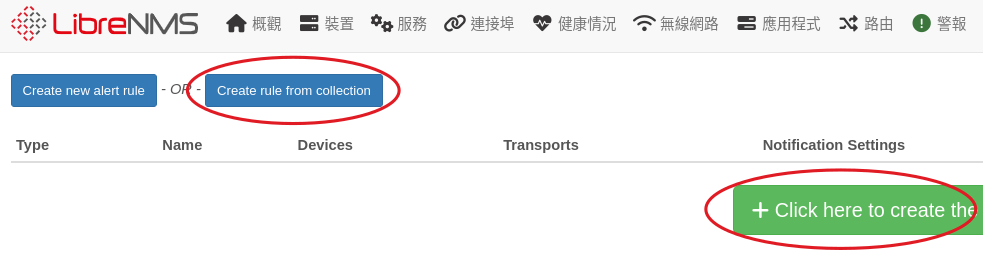
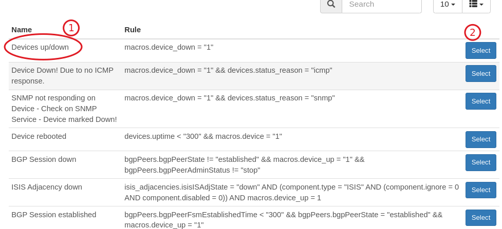
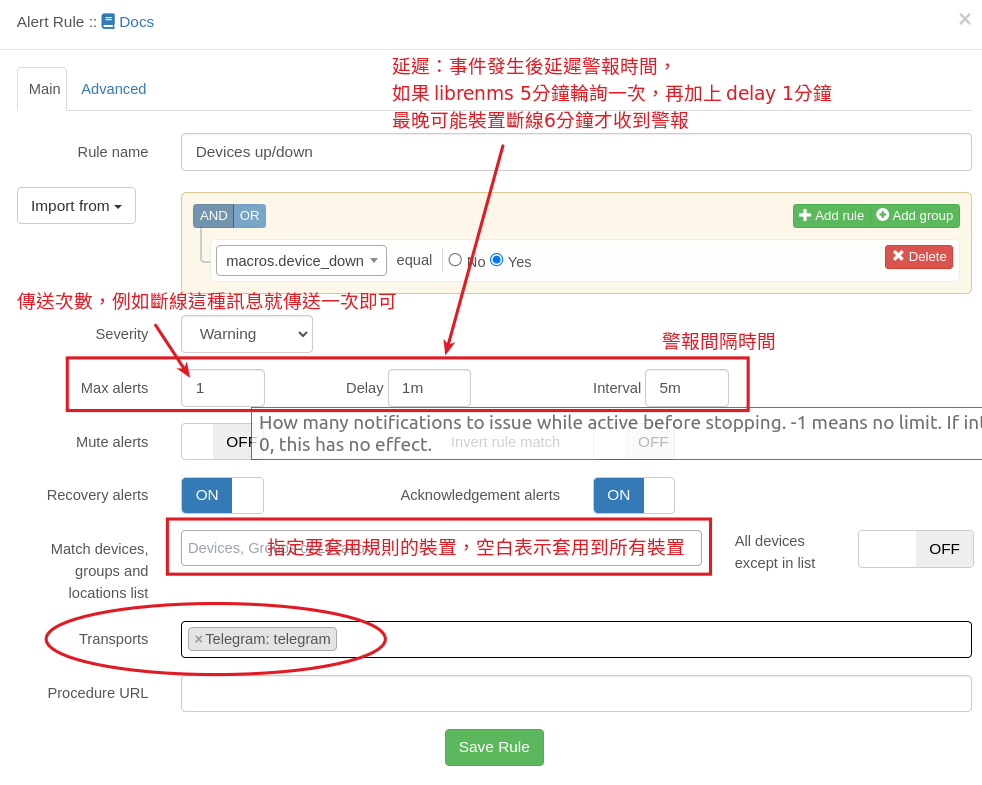

# 警報

裝置離線或是溫度過高， LibrenNMS 可以發出警報提醒，除了顯示警報在 LireNms 界面外，還可以使用多種通知方式 ex: mail、sms、telegram 通知網管，以下將介紹使用 telergam 來傳送警報訊息，要主動傳送警報，有三個部份需要設定:

1. 傳送器： 設定 librenms 要怎麼傳送訊息（以下示範使用 telegram）
2. 規則： 什麼事件（條件）會觸發警報
3. 範本： 發生事件時要傳送的內容

## telegram 安裝及中文化
可先參考以下網頁，安裝 telegram [telegram 安裝及中文化](https://www.pkstep.com/archives/13832)

## 申請 telegram bot

在 telergram 搜尋 @botfather 這個帳號，然後點入跟這個機器人聊天


在聊天室打上依序打上以下的內容，就可以取得機器人的 token，請記住這個資訊


接著在瀏覽器打上，將<你的token>替換成前面取到的 token

[https://api.telegram.org/bot<你的token>/getUpdates](https://api.telegram.org/bot<你的token>/getUpdates)

我們需要的就是回傳資料裡面的聊天室id(chat id)



## 建立 librenms 警報傳送器
1. 

2. 

3. 傳送器類型選擇：telegram。 填入前面取得的 chat id 跟 token，格式可以選擇 HTML 也可以順便設定為預設的傳送器


## 建立警報規則
1. 執行主選單【選單/警報規則】


2. 中間有個按鈕，點下去就會建立很多預設的規則，有興趣可以直接建立，然後觀看學習。 Librenms 也收集很多規則可以套用，所以手動建立規則也很方便


3. 以下使用 Create rule from collection 手動建立，按下 Create rule from collection 按鈕，裡面有收集很多規則，我們選擇 Devices up/down ，當裝置離線時，就會產生警報

設定警報條件


## 警報範本
有傳送器，有規則，最後還要有警報範本（要傳送的警報內容），這三項缺一不可。
官方說明有提供範本內容，依據不同規則，我們需要知道的資訊不一樣，所以才需要不同範本。例如裝置斷線我們只需要知道是哪台主機跟位置，硬碟容量使用過高，我們會想要知道硬碟空間使用多少、剩餘多少...等。
也可以所有規則都套用一個警報範本，只是這樣警報的內容可就會太複雜或是缺少需要的資訊。

[官方文件：Templates](https://docs.librenms.org/Alerting/Templates/)

底下是一個純文字的警報範本
```
{{ $alert->title }}
嚴重性: {{ $alert->severity }}
@if ($alert->state == 0) 經過時間: {{ $alert->elapsed }} @endif
警報時間: {{ $alert->timestamp }} Unique-ID: {{ $alert->uid }} 
硬體：{{ $alert->hardware }}
位置：{{ $alert->location }}
@if ($alert->faults)
故障:
@foreach ($alert->faults as $key => $value)
  #{{ $key }}: {{ $value['string'] }}
@endforeach
@endif
```


接著就等待警報發生吧! >< (聽起來怎麼怪怪的！！)

## 修正時區
收到警報訊息會發現上面的時間不對， librenms 時區是使用 php 的環境設定，所以要修改 php 的設定檔，執行
```sh
sudo nano /etc/php/8.1/fpm/php.ini
```
找到 date.timezone 設定，將他修改成 
```
date.timezone = "Asia/Taipei"
```
然後重啟 php
```sh
sudo systemctl restart php8.1-fpm.service
```