#  Weathermap 網管也要看天氣？？

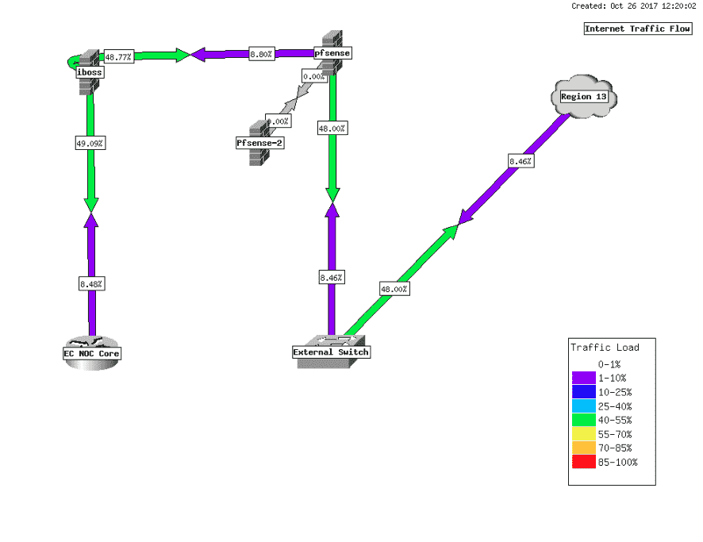

Weathermap 是用來視覺化網路傳輸跟實體線路頻寬的比例，用來觀察整體實體線路架構頻寬是否足夠。


官方安裝文件
https://docs.librenms.org/Extensions/Weathermap/

使用虛擬機安裝的 linrenms 已經內建 Weathermap 就可以直接使用不需要安裝步驟了。

不過說明文件內缺少了要安裝 php-pear Weathermap 才能正常使用，所以還是要手動安裝 php-pear，之後重新啟動 php-fpm (8.1是版本號碼，要依照系統安裝的版本做修改)

```shell
sudo apt install php-pear
sudo systemctl restart php8.1-fpm.service 
```

## 開啟編輯器
1. 
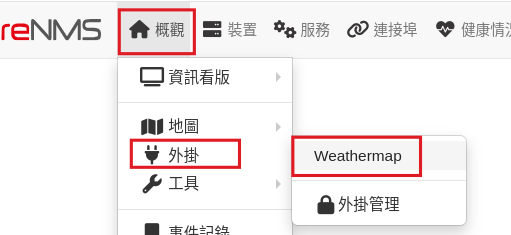
2. 
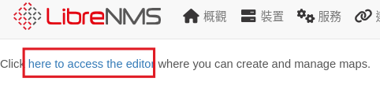
3.
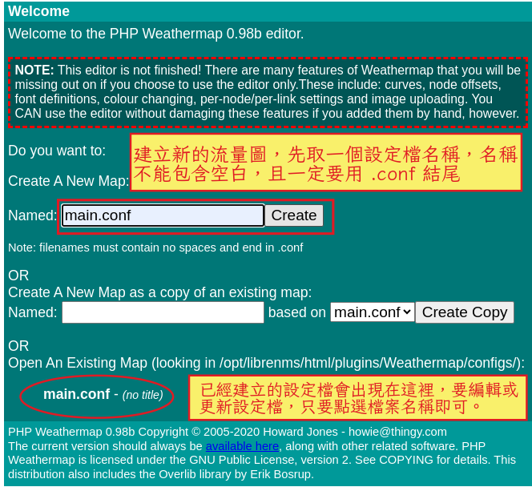

## 編輯輸出的網頁及圖形檔
weathermap 會定時讀取 rrd 資料，然後將流量繪製至一個圖形檔，所以我們先設定要輸出的檔案名稱
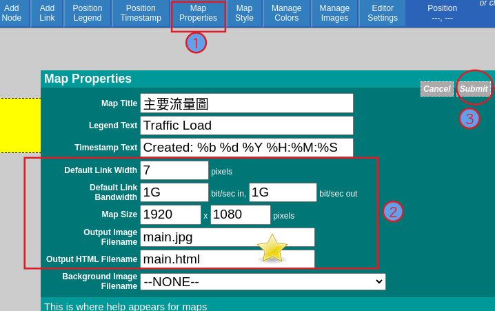

## 加入節點
1. 加入要顯示的交換器（防火牆）節點
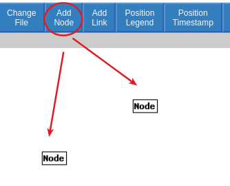
1.先點選 Add Node 功能按鈕，然後在要放置節點的位置，點滑鼠左鍵，就會在圖面放上一個節點

2. 點選節點，可以編輯節點的資料，我們假設左邊為 A 節點，右側為 B 節點，分別設定 A 、B 節點是哪台交換器，並選擇要顯示的圖示
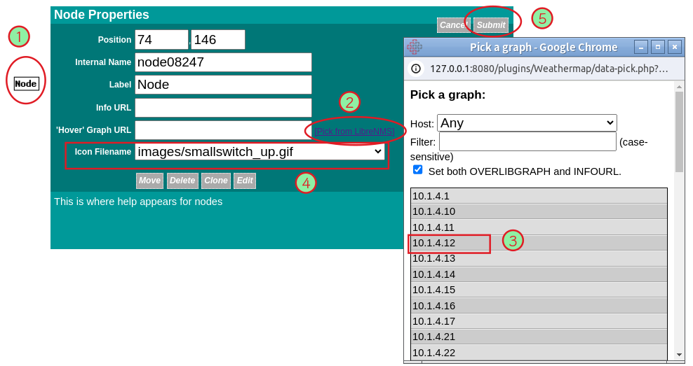
3. 要移動節點位置、刪除節點、修改顯示名稱，則一樣點選節點，然後在編輯對話框執行對應的動作
   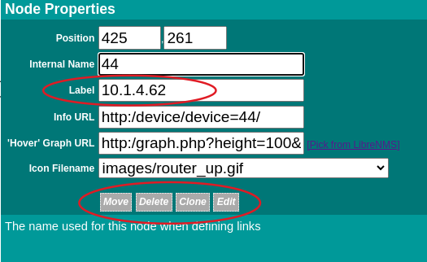

## 增加連線

假設 A 交換器的 port 5 連接到 B 的 port 7， 我們在設定節點的資料時，只需要選擇 A port 5 或是 B port 7 其中一個 port 就可以設定好連線，所以要先決定等一下打算用 A port 5 或是 B port 7 來當資料。決定好之後，才能接下來的動作

我們假設要選 A port 5 ，當連線資料來源。接著點選 Add Link，然後依序點擊圖面上的 A節點圖示、B節點圖示，節點點選的順序很重要，不然連線顯示的資料方向會錯誤。
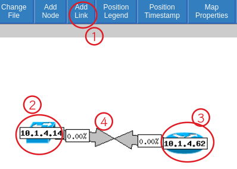

接著點選連線（上圖步驟4），編輯連線的資料來源
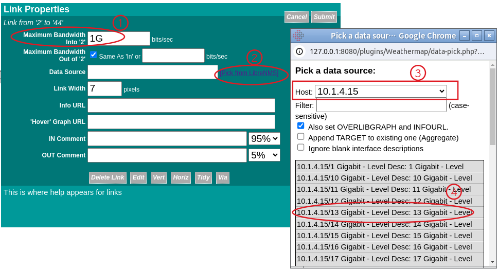
第一欄要設定線路頻寬，這樣依流量佔頻寬比例會依比例不同顯示出不同顏色。然後選擇是哪個交換器的那一個port即可。

5. weathermap 流量圖並是即時更新，預設是每五分鐘會重新繪製一次，要觀看繪製的圖形，請執行【概觀/外掛/Weathermap/流量標題】
   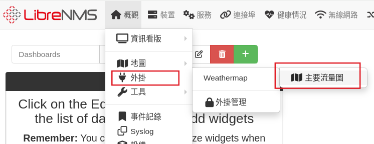

## ipv6 連線 BUG
 如果 ipv6 的連結不會正常顯示，點選 ipv6 節點的 port之後，將 ipv6 位址的 : 改成下底線 _。
 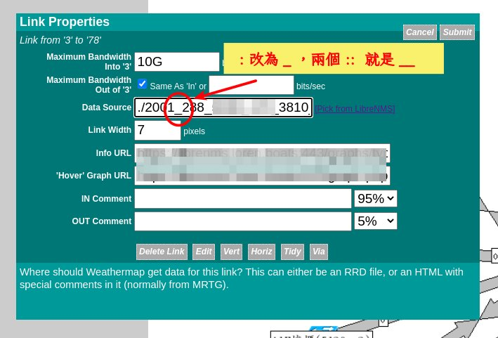


## 把流量圖加入資訊看板
Wethermap 會產生一個 html 跟一個圖片檔。資訊看板中，有一個外部影像的小部件，只要複製圖片網址，就可以將 weathermap 圖片顯示在看板中。不過如果一開始就打算放在看板內， Weathermap 的圖片大小建議設定小一點，以免看板顯示的圖片不清楚。


