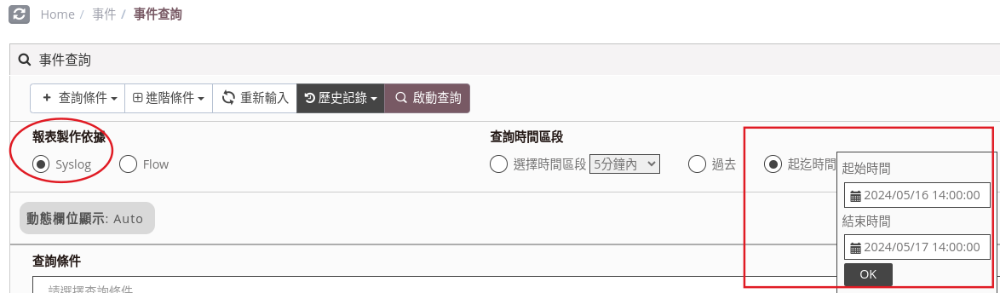
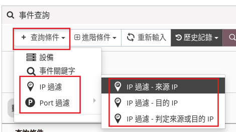
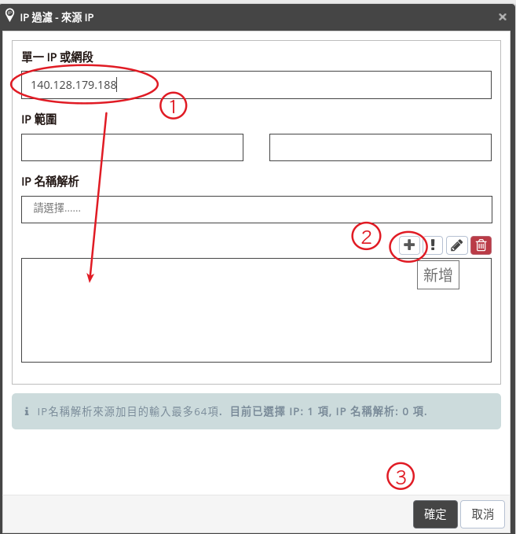
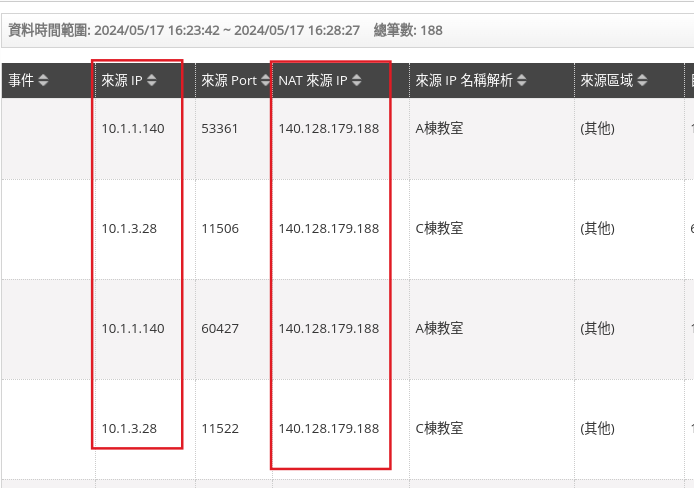

ncloud 介紹，
1. [直接看官網的說明](https://www.npartnertech.com/product_d.php?i=3)
2. [臺中市政府教育局113年網管工作圈第一次工作會議-簡報](https://docs.google.com/presentation/d/1M_bdKWdrOoLZ9AB8WmigGxcBh85bKeHeQN2EDOeTF20/edit)

摘要：
* 各種網路、設備Log資料的集中管理中心
* 可同時接收 Netflow、 jFlow、sFlow 等流量資訊
* 內建人工智慧的自動學習與趨勢分析
* 可將所有資料進行平行比對，輕鬆查看全網的網路情形並進行資安危機分

### 結論
它沒說它有 snmp 管理功能 ，是吧？？

個人想法，它就是一個日誌伺服器，用來收集各種 log，並且將 log 依照各種條件整理成各種報表。

## 查詢防火牆紀錄

log server 最重要的就是日誌紀錄搜尋（ncloud 稱為事件），如果發生資安事件，就使用「事件/事件查詢」的功能來搜尋紀錄。
因為 forgate 防火牆紀錄有包含原始 ip 跟 nat 出去的對外 ip ，所以依據被鎖住的 ip 跟事件發生時間查詢就可以比較容易判斷是哪台校內的裝置發生資安事件。

1. 防火牆紀錄是屬與 syslog ，選定小範圍的時間
   
2. 依據資安事件的訊息，使用來源 ip 、 目的 ip 或是連接的 port 作為篩選選範圍，條件越嚴格篩選出來的紀錄更會精準更容易找出問題。

ncloud 最不直覺的就是這個設定要查詢的 ip 或範圍的操作，常常忘記按 + 就按下確定。

3. 資安事件紀錄的通常是對外的真實 ip，這裡以一個實際上電腦是虛擬段，但是使用 nat 的對外 ip 做示範。查詢出來的欄位很多， nat 來源的欄位在很右邊，所以要找一下，以下有移動欄位順序，方便讓它同時顯示。

可以看到同時間有哪些校內電腦是同時使用同一個對外 ip做連線的，如果前面篩選的條件越嚴格，就更容易找出

