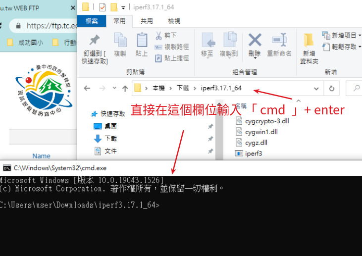
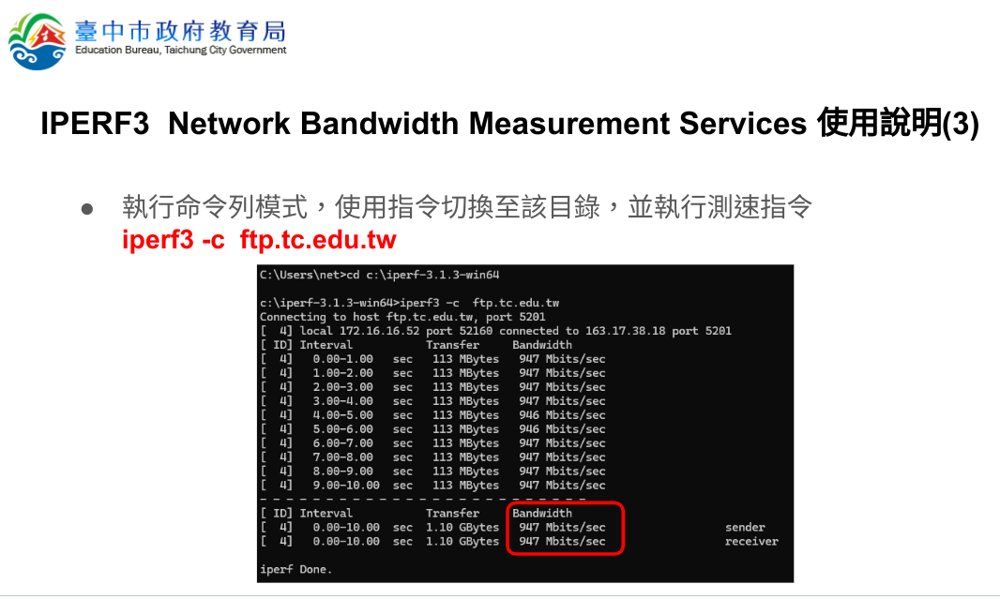
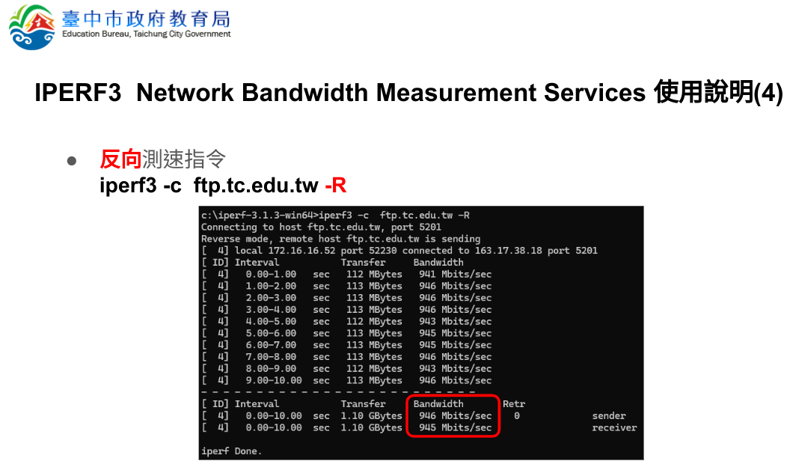
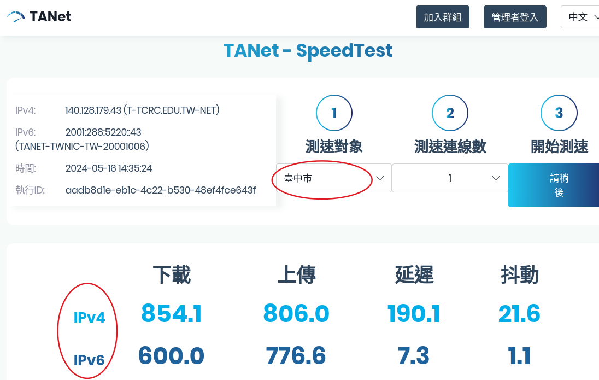
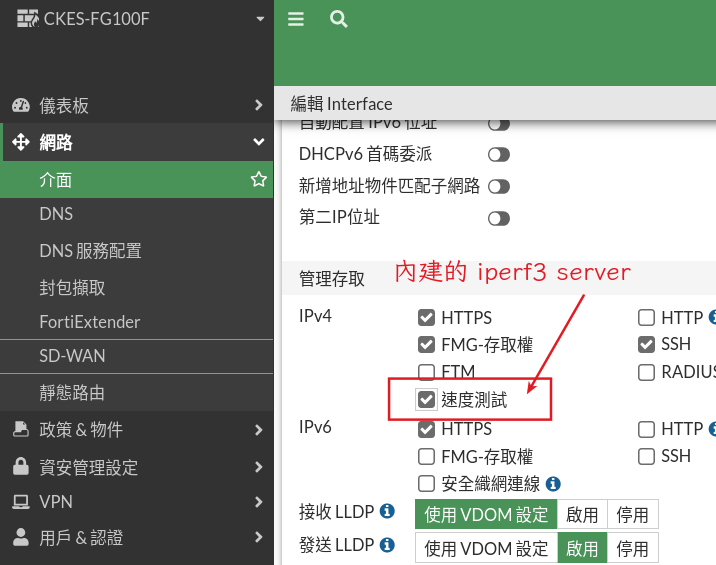

# iperf3

iperf 是一個自由可用的開放原始碼網路性能測試軟體程式。

1. [臺中市教網中心下載](https://ftp.tc.edu.tw/TC_limit/iperf3/)
2. [iperf 官方網站下載](https://iperf.fr/iperf-download.php)

下載解壓縮後，使用命令列視窗，進入剛剛解壓縮的目錄
我們可以使用檔案總管，在上方資料夾路徑的地方，打上 cmd + enter 就可以開啟命令列視窗，並進入該目錄



** 注意，一定要正常解壓縮，不能偷懶使用檔案總管直接點進去壓縮檔裡面，這樣打 cmd 只會開啟命令列視窗

## 測試連到教網的速度
建議找一台最靠近防火牆的機器測試，這樣比較不會被校內網路干擾


下載速度測試，記得參數 R 要大寫


::: tip
預設是使用 tcp 測試速度，其實使用 udp 測速會更接近線路傳輸速度，因為 udp 可以省略一些協定的溝通，要使用 udp 測試，可以加上 -u 的參數
:::
```
iperf3 -c ftp.tc.edu.tw -R -u
```

### TANet 網頁測速
iperf3 是比較準確的工具，但是缺點是要帶著 iperf3 的執行擋，如果突然在某台電腦想測試一下連線是否正常，可以使用 [TANet 的測速網頁代替](https://sp.tanet.edu.tw/) ， tanet 測速網頁還可以同時測試 ipv6 跟 ipv4 的速度



## 測試校內電腦到防火牆的速度

找一台電腦執行 iperf3 -s ，這台電腦就可以變成 iperf3 server 
```
   iperf3 -s 
```

   其他電腦就可以用前面的指令測試到防火牆的速度了

其實 fortigate 防火牆有內建 iperf3 server，所以也可以開啟防火牆內建的 server，就可以省下另外找一台電腦 執行 iperf3 -s 了

### fortigate 開啟 iperf3 server
先在防火牆 CLI控制台內，貼上以下指令啟用測速伺服器
```
config system global
    set speedtest-server enable
end
```
接著再到各界面開啟要使用這功能


::: warning
經測試 fortigate 內建的 iperf3 似乎不支援 udp 模式
:::

### 架設 [LibreSpeed](https://github.com/librespeed/speedtest) 測試網頁
跟前面一樣，如果臨時需要測試到機房的速度，還要下載 iperf3 程式有點麻煩，在機房放個測速點，會比較方便。

LibreSpeed
No Flash, No Java, No Websocket, No Bullshit.
This is a very lightweight speed test implemented in Javascript, using XMLHttpRequest and Web Workers.

如果不需要儲存測速結果，那安裝就非常簡單，把檔案放在一般 web server 就可以了。
